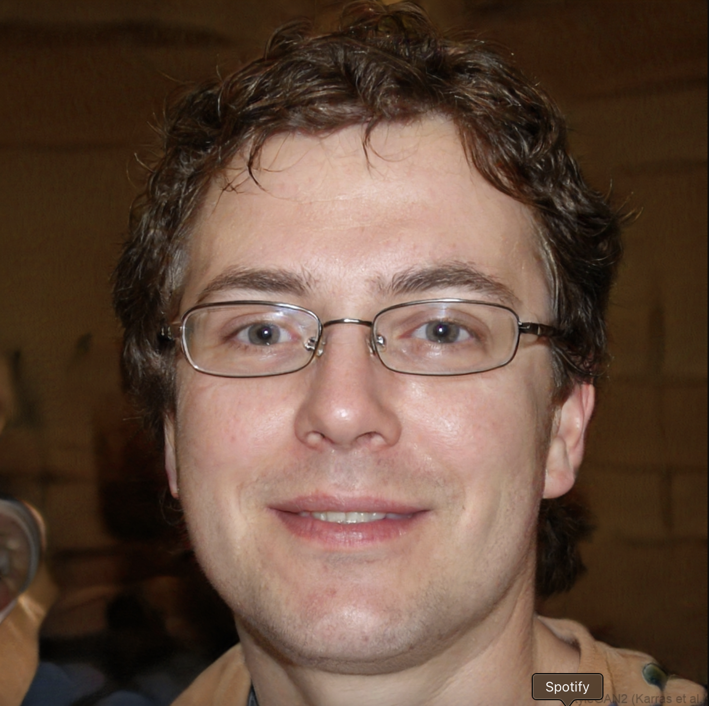

#   
**Name:** Andrew Neiman
**Age:** 23 
**Occupation:** Student
**Location:** New York, USA

## Background  
Student of business. He is an ammature drummer, and he wants to get better. He is dedicated and will use the app daily.

## Daily Life  
He practices a lot. Most of the training is playing along to songs. For the rudiment training he has to use a metronome and pen & paper to track his progress

## Goals & Needs   
Main goal is to improve his drums playing as much as possible, while tracking progress.
Rudiments and stick control is one of the most important factors in overall drum level.
He doesn't have a practice plan

## Pain Points & Challenges  
[Describe the main frustrations, obstacles, or inefficiencies they encounter related to the product or service you are designing for.]  
Tracking progress takes extra time, it is not all in one place

## Motivation  
*"Why do they engage with this product or service?"*  
[Summarize their core motivation in a compelling way. This could be a short paragraph or even a strong, direct quote that captures their drive.]  
